# Bypass Firewall

## Setup a ShadowSocks

Shadowsocks is a free and open-source encrypted proxy project, widely used in mainland China to circumvent Internet censorship. Typically, the client software will open a socks5 proxy on the machine it is running, which internet traffic can then be directed towards, similarly to an SSH tunnel. Unlike an SSH tunnel, shadowsocks can also proxy UDP traffic.

### 1. Why using ShadowSocks
The primary difference between shadowsocks and a regular VPN is this looks identical to HTTP traffic or regular SSL traffic. So this is totally no difference between this and regular Internet browsing. So this is secure. 

### 2. Shadowsocks overview
Shadowsocks is a secure split proxy loosely based on SOCKS5.

client <---> ss-local <--[encrypted]--> ss-remote <---> target

The Shadowsocks local component (ss-local) acts like a traditional SOCKS5 server and provides proxy service to clients. It encrypts and forwards data streams and packets from the client to the Shadowsocks remote component (ss-remote), which decrypts and forwards to the target. Replies from target are similarly encrypted and relayed by ss-remote back to ss-local, which decrypts and eventually returns to the original client.

#### 

### 3. Setup my Shadowsocks
#### 1. Setup Cloud Server
I use Digital Ocean cloud server. This is much cheaper than others such as AWS/Google Cloud. I setup a ubuntu server. (You can got 100 dollars in first 60 days)

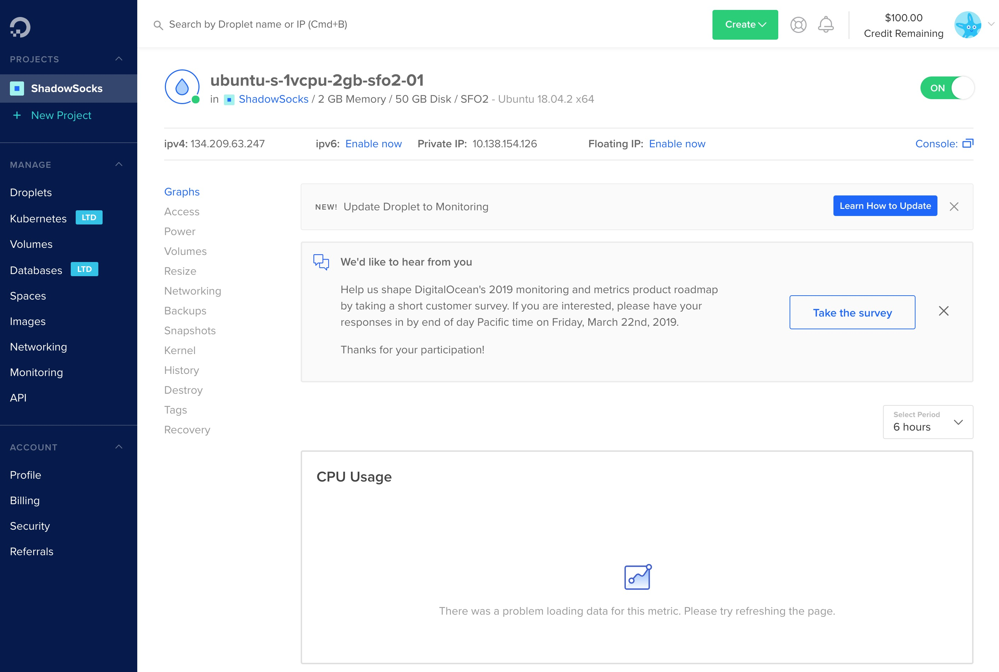
#### 2. Login Cloud Server
 After finish setup, I got the Ip address and password. So using terminal to ssh into this cloud server.
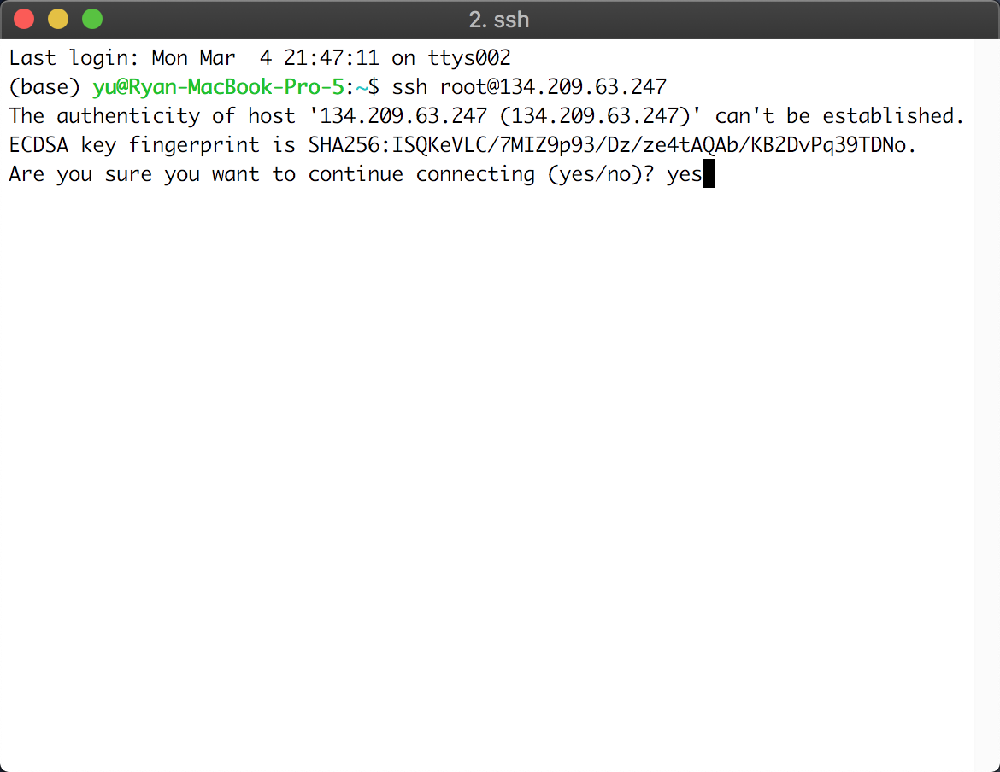
#### 3. Setup Password
The first time when you login you need to reset the password of cloud server.
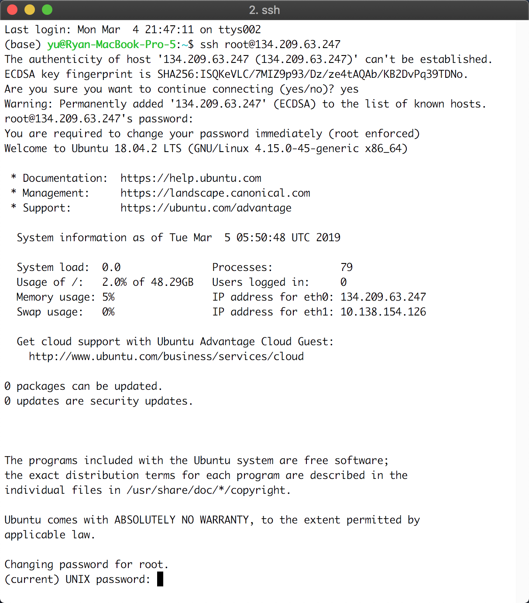
#### 4. Update server's software
Update and upgrade the software on the server.
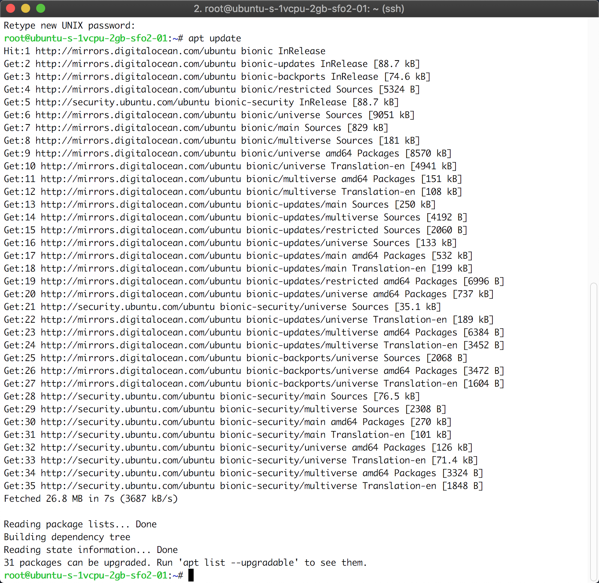
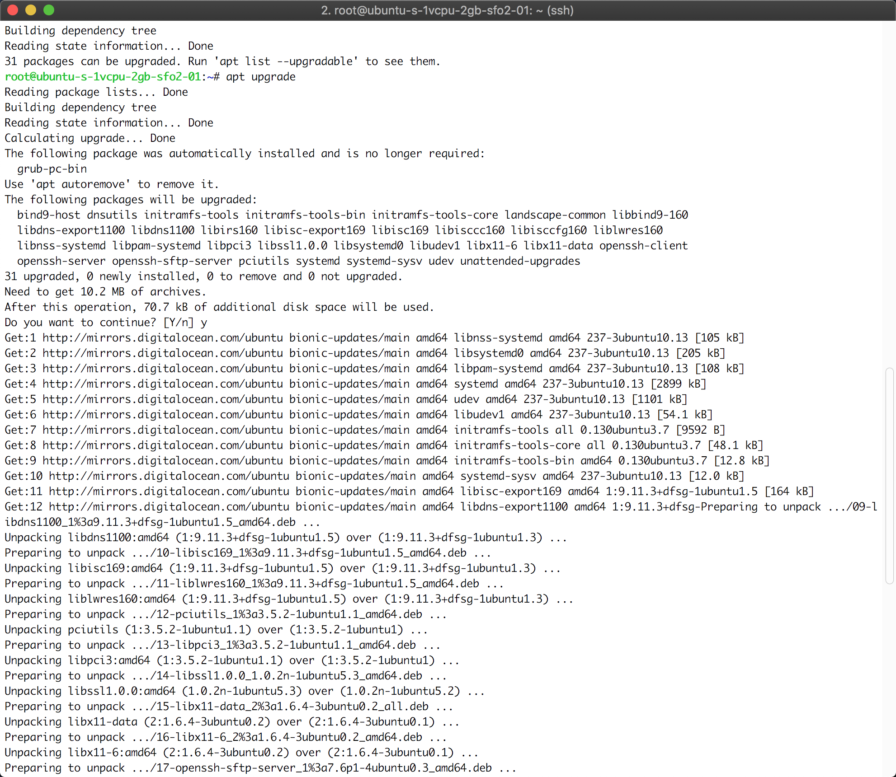
#### 5. Install Shadowsocks
Install the shadowsocks in the server.
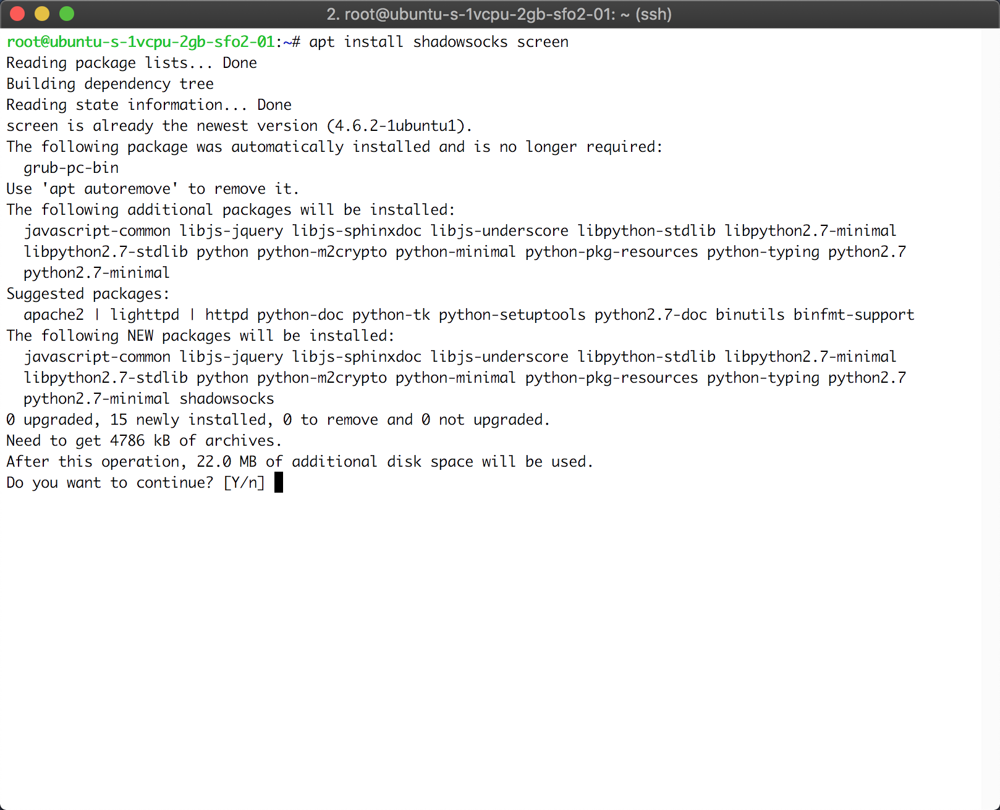
#### 6. Start Shadowsocks Server
Type screen to start a screen session and start a shadowsocks server. Part of "-m" is the stream cipher we choose. Part of "-k" is the password. Part of "-s" is the IP address.

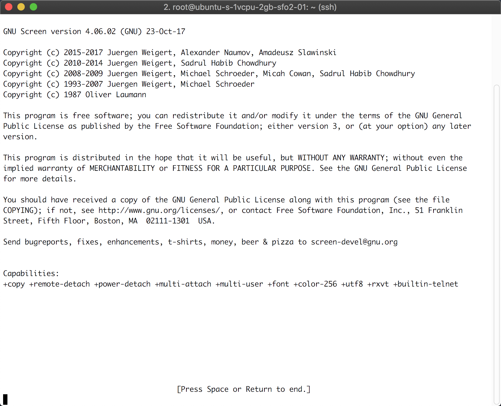
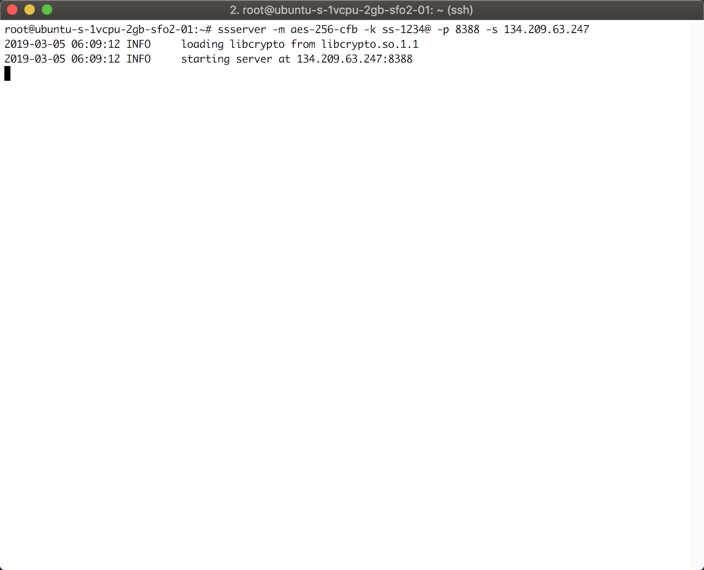

#### 7. Download client
Then I download the mac os client.
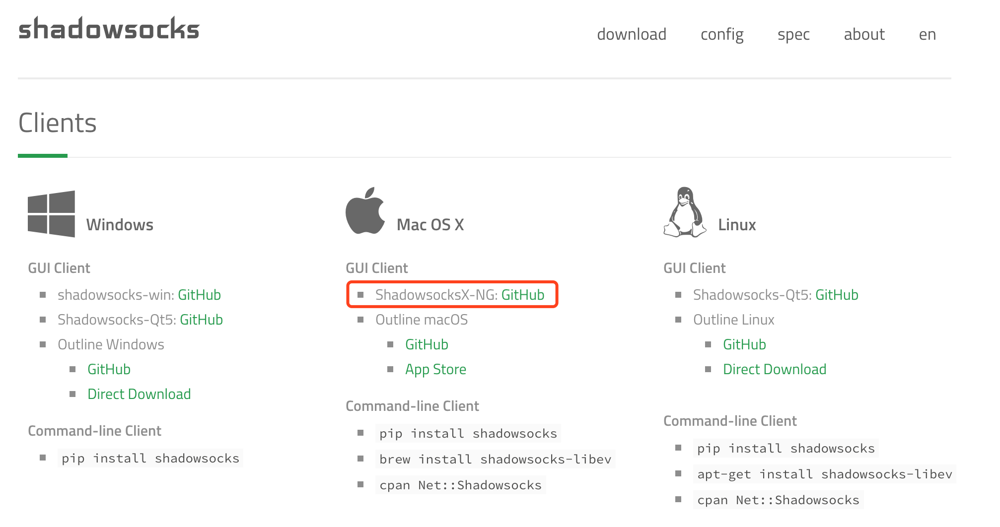
#### 8. Setup client
In this app, choose Manual Mode and click Server Preferences.

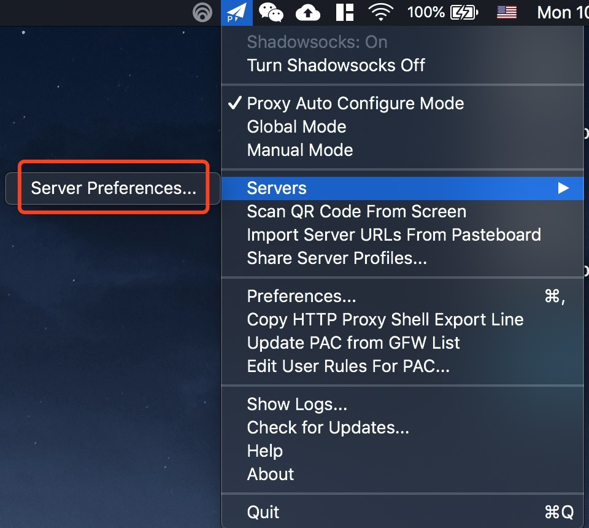
Add the password, IP address and port number. And we are good to go.
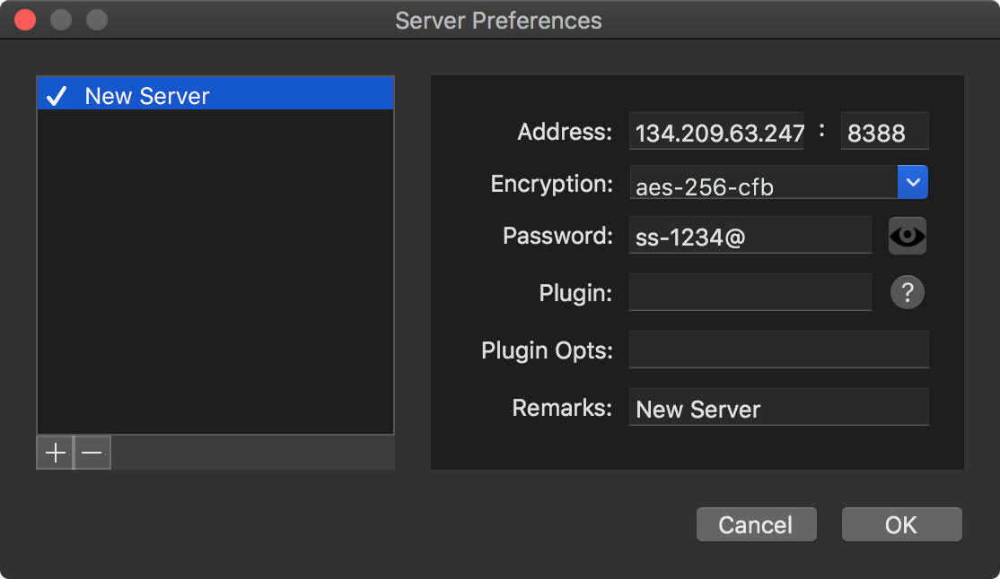